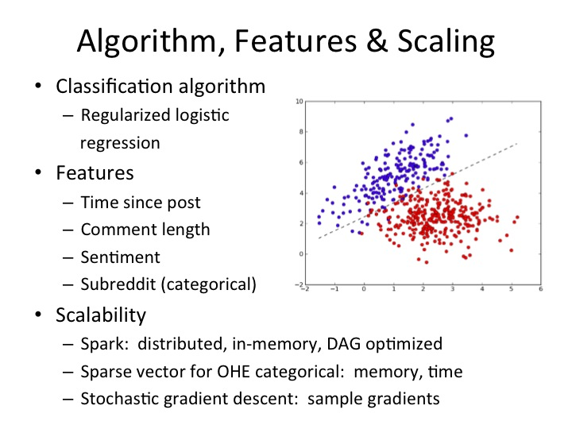
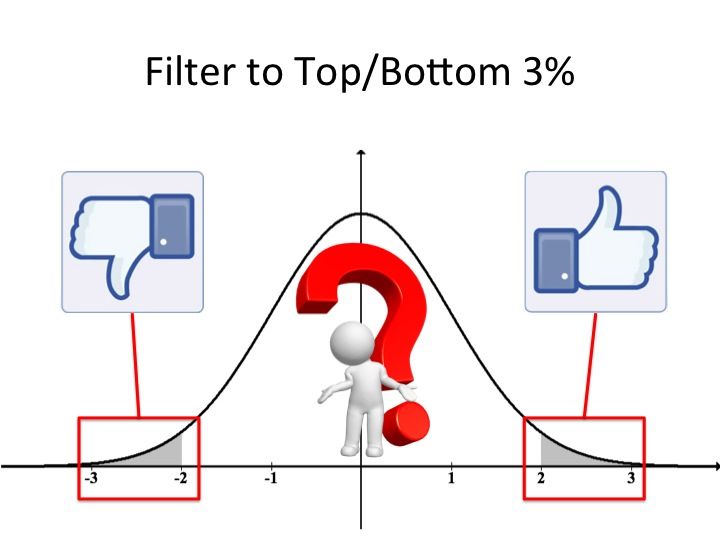
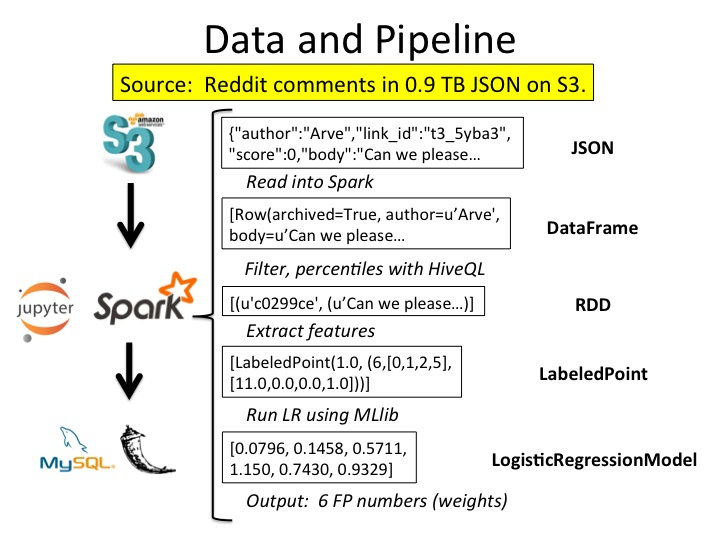
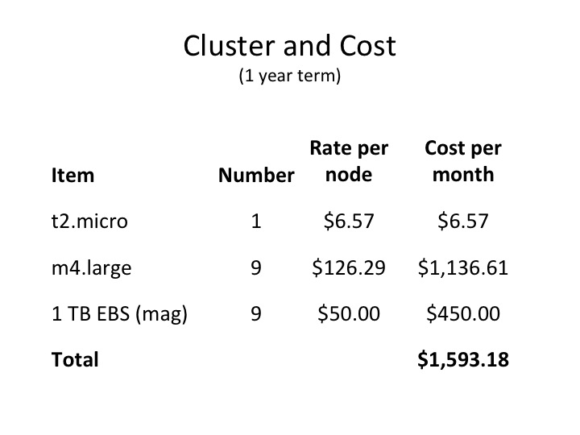
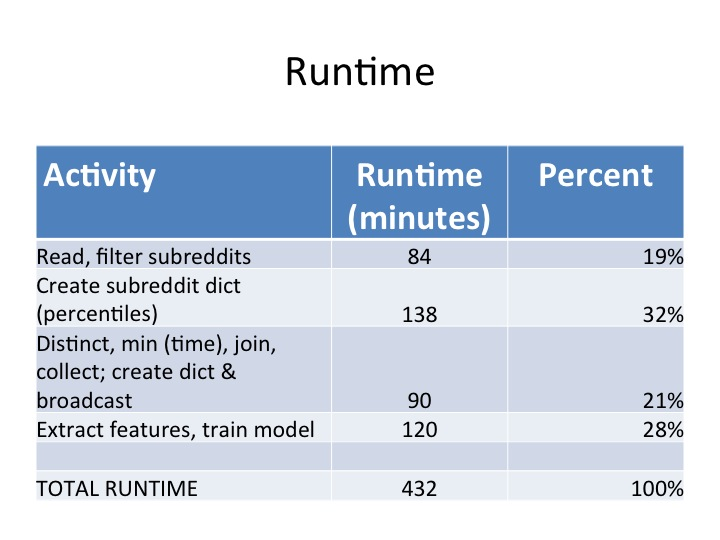
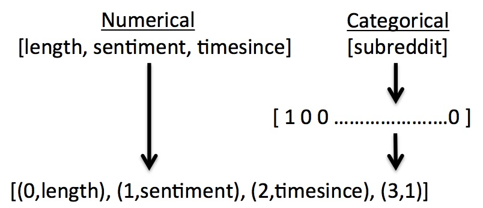
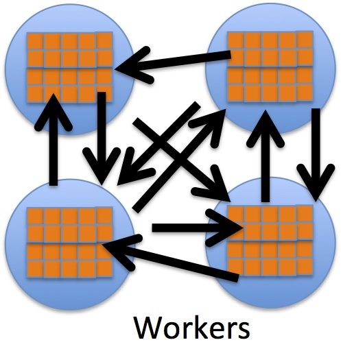
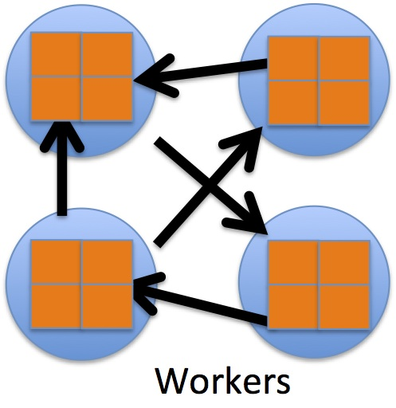

# UPDATE
I revisited this problem after five years and got MUCH better accuracy in a tiny fraction of the time.  See [GirlGamers](https://github.com/jonneff/GirlGamers) for the "new textfit."    

# Introduction to textfitXL
============

Table of Contents:

1. [Introduction](README.md#1-introduction)
2. [Algorithm, Features, Scaling and Filtering](README.md#2-algo)
3. [Data and Pipeline](README.md#3-pipeline) 
4. [Cluster and Cost](README.md#4-cluster)
5. [Accuracy and Runtime](README.md#5-accuracy)
6. [Engineering Challenges](README.md#6-challenges)
7. [Installation Instructions](README.md#7-install)

## 1. Introduction

In July 2015, Dr. Alyssa Fu, an Insight Data Science Fellow at the time, trained a logistic regression model in R to predict whether a comment would be voted up or down on Reddit.  Her training data was extracted from about 500,000 comments she downloaded through the Reddit API for April and May 2015.  The name of her project was [textfit](https://github.com/alyssafu/Insight-Project).  

The goal of textfitXL is to scale up Dr. Fu's project to handle 1.6 billion comments (908 GB) comprising eight years of Reddit data from 2007 to 2015.  Note that no attempt was made to alter or improve her original approach.  The source data was obtained by Jason Baumgartner.  Insight program directors obtained the data from [here](https://archive.org/details/2015_reddit_comments_corpus) and placed the data in 92 files in an Amazon S3 bucket.  

textfitXL is implemented on an AWS cluster using the Apache Spark Python API.  The repository also includes a [simple web app](http://www.textfitxl.com/) that allows a user to select a Reddit post, type in a sample comment, and get a prediction of whether the comment will be voted up or down.  The web app re-uses much of Dr. Fu's code, with her permission.  

The results of processing 908 GB of data are shown in the static file /notebook/logistic_regression.html.  

The folder /app contains the Python source code for this project while /data contains a subset of the input data.

## 2. Algorithm, Features, Scaling and Filtering

The figure below shows the basic approach used in textfitXL.  

Regularized logistic regression is used to classify comments as either upvoted (1) or downvoted (0).  As in Dr. Fu's project, four features were used:  time since post, comment length, sentiment, and subreddit.  Subreddit is a categorical variable with four categories:  GirlGamers, leagueoflegends, pics, and politics.  (While Reddit has many thousands of subreddits, Dr. Fu chose four for her model.)  Since post (submission) data was not readily available, the minimum time comment for each post was used as a proxy for the post time in this calculation.  Sentiment analysis is done using the [AFINN](https://github.com/fnielsen/afinn) model, which is essentially a table lookup based on movie reviews.  Per the request of the author, listed below is the reference for the paper describing AFINN:

Finn Årup Nielsen, "A new ANEW: evaluation of a word list for sentiment analysis in microblogs" , Proceedings of the ESWC2011 Workshop on 'Making Sense of Microposts': Big things come in small packages 718 in CEUR Workshop Proceedings: 93-98. 2011 May. Matthew Rowe, Milan Stankovic, Aba-Sah Dadzie, Mariann Hardey (editors)

Scalability is achieved by using Spark for parallel processing.  The features are placed in a SparseVector format, which reduces memory and processing time during execution.  Finally, stochastic gradient descent is used to reduce time to calculate gradients, which can be a compute-intensive process.  

The initial 908 GB dataset is filtered down to less than 55 GB by choosing only comments that are in the top or bottom 3% of votes.  Dr. Fu's experience was that logistic regression models have difficulty training on data points that are not "extreme" values in terms of up and down votes.  

## 3. Data and Pipeline

The figure below shows the data transformations and pipeline used in this project.  

The source data consists of 92 JSON files in S3.  The Ipython notebook reads the JSON data into a Spark DataFrame using schema on read to speed up data ingestion. The DataFrame format makes it straightforward to select the subreddits of interest.  The percentile UDAF in Hive Query Language is used on a DataFrame to calculate the 3rd and 97th percentiles for each subreddit for filtering the data.  Finally, the DataFrame join method is used to combine the "extreme" top/bottom 3% data with the minimum comment times to enable calculation of "time since post."  

Most of the feature extraction is done using ordinary Spark RDDs.  The data is then put into a SparseVector object and loaded into a LabeledPoint for input to the machine learning library.  The output of training Spark's logistic regression model consists of six floating point numbers, which are the model weights.     

## 4. Cluster and Cost

The figure below shows the cluster configuration and cost.  

## 5. Accuracy and Runtime

Accuracy was calculated as the percentage of labels correctly predicted on the training set.  textfitXL had accuracy of close to 60% for small subsets of the Reddit comment dataset.  Current results show 52% accuracy for the entire 908 GB dataset with a runtime of 7.2 hours for reading, processing and training the model.  Dr. Fu previously obtained accuracy of 65% using a much smaller dataset. 

One possible explanation for the reduced accuracy is that textfitXL does not exclude outliers and deeply nested comments as Dr. Fu did with her smaller dataset.  (This is the only algorithmic difference between the original textfit and textfitXL.)  In her two month dataset, Dr. Fu observed several anomalies including comments that consisted of nothing but thousands of expletives and repeated negative words.   Comments like this would result in extreme sentiment scores which would be difficult to fit.  It may be possible to improve the accuracy of textfitXL by carefully analyzing the entire corpus and programmatically excluding certain outliers.  

The textfitXL pipeline makes it possible to do further work to improve accuracy, such as exploring and cleaning the data and trying out different classifiers and hyperparameter settings.  

During the course of this project, Jason Baumgartner published an additional corpus containing Reddit post (submission) data over roughly the same time period as the comment data.  Both data sets were loaded into Google BigQuery.  An intriguing possibility for improving runtime performance would be to push most of the preprocessing, filtering and joining into BigQuery and ingesting only the subset of data used for feature extraction. 

Runtime details are shown in the figure below.

## 6.  Engineering Challenges

A number of engineering challenges were overcome while developing textfitXL.  The first hurdle was combining numerical and categorical variables in the feature set.  This is straightforward in R and scipy.stats but there were no examples of this with Spark.  The standard way to handle categorical variables is to convert them into dummy variable vectors using one-hot encoding.  This tends to produce very large sparse vectors with many zeroes and a few ones.  While the current version of textfitXL uses only one categorical variable (subreddit) with only four categories, the design philosophy was to make data structures and algorithms scalable wherever possible.  Spark has a convenient SparseVector data structure that uses indexes to greatly reduce the memory required for sparse data.  Using the SparseVector data type also reduces processing time since fewer operations are needed to multiply two SparseVectors, which is done repeatedly in logistic regression.  

The solution to the mixed variable types was simple:  move the starting index for the categorical variable to account for the leading numerical variables.  This allows any number of categorical variables and categories to be added with relatively small impact to memory and processing time.  

Another challenge was very slow percentile and minimum time calculations.  textfitXL initially used a T-digest probabilistic data structure for percentile calculations and a map-reduce transformation to find the time of the first comment for a post.  This proved to be very inefficient.  Doing these calculations in Spark's DataFrame format greatly improved performance.   In particular, the percentile function in HiveQL reduced the time to calculate percentiles from many minutes to seconds.  

The most difficult engineering challenge involved a very slow and brittle join done between the "extreme" top/bottom 3% data and the minimum comment times to calculate "time since post."  When examining the Spark UI after a job failure during the join operation, it was observed that the join stage was failing due to socket timeout exceptions.  From this it was inferred that the large number of partitions resulted in a very large amount of shuffling which was overloading the network IO cards on the nodes.  This situation is illustrated in the figure below.

The obvious solution is to reduce the number of partitions through a coalesce operation before executing the join.  What is not obvious was that the coalesce cannot be done too early in the overall process or the initial read from S3 will fail.  If the coalesce is done too late, the join will fail.  The correct point for the coalese was found through trial and error and a count operation was added to force Spark to execute the repartition before doing the join.  

The join was also improved by refactoring the code to use DataFrames instead of RDDs for the join and scaling up the nodes to use higher throughput network cards.

These improvements enabled the application to read and process almost a terabyte of data for logistic regression and increased overall execution speed by 230%.

## 7.  Installation Instructions

See the [install directions](INSTALL.md) for installation instructions.  
